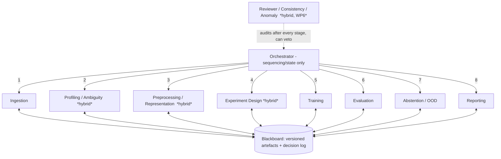

# Agentic MedMNIST — hybrid multi-agent training framework

A deliberately **minimal** demonstrator: role-specialised agents train a neural
network on [MedMNIST](https://medmnist.com/), communicating only through typed,
versioned artefacts. *Maximum cohesion, minimum coupling.*

The ML model is intentionally tiny — the **agentic orchestration is the
contribution**, not the classifier.

## Architecture



No agent calls another. They read/write **artefacts** (`contracts.py`) via the
**Blackboard**. Swapping or upgrading one agent touches no other — that is the
coupling claim, made concrete.

## The agents

| Agent                 | Duty                                                                                         | Kind             | Innovation                           |
| --------------------- | -------------------------------------------------------------------------------------------- | ---------------- | ------------------------------------ |
| Orchestrator          | sequencing, veto handling                                                                    | deterministic    | —                                   |
| Ingestion             | load + subsample MedMNIST                                                                    | deterministic    | —                                   |
| Profiling / Ambiguity | profile data, flag ambiguity                                                                 | **hybrid** | data-ambiguity handling              |
| Preprocessing         | architect best representation (normalization + label-preserving augmentation), then apply it | **hybrid** | representation architect             |
| Experiment Design     | pick config from profile*and* representation                                               | **hybrid** | data- & representation-driven tuning |
| Training              | train tiny CNN                                                                               | deterministic    | —                                   |
| Evaluation            | test metrics                                                                                 | deterministic    | —                                   |
| Abstention / OOD      | refuse when unconfident                                                                      | deterministic    | "no clear finding" case              |
| Reporting             | assemble dossier                                                                             | deterministic    | —                                   |
| Reviewer (WP6)        | cross-cut consistency/anomaly, can veto                                                      | **hybrid** | independent auditor agent            |

## Hybrid approach

Deterministic execution everywhere reproducibility matters (data, splits,
training, metrics). **LLM reasoning only** at the four judgement points
(ambiguity, representation design, config choice, consistency review), behind one thin seam
(`llm.py`). It targets any OpenAI-compatible endpoint, so you plug in a **local
open model** (Ollama / vLLM) — no vendor lock-in. With none configured it falls
back to heuristics, and the pipeline still runs offline and reproducibly. Every
decision records its `source` (model name or `heuristic`).

## Run

```bash
pip install -r requirements.txt
python run.py                                   # deterministic
AGENTIC_LLM_BASE=http://localhost:11434/v1 \
AGENTIC_LLM_MODEL=llama3.1 python run.py         # hybrid with a real open model
```

Outputs: `runs/latest/artefacts/*.json` (every hand-off), `dossier.json`, and a
console comparison of the agentic run vs. the conventional `baseline.py`.

## Map to work packages

WP1 requirements/feasibility · WP2 Ingestion + Profiling/Ambiguity · WP3
Experiment Design + Training · WP4 Evaluation + baseline comparison · WP5
Abstention/OOD MVP · WP6 Reviewer/anomaly agent (cross-cutting).

## Files

| File                | Role                                           |
| ------------------- | ---------------------------------------------- |
| `contracts.py`    | artefact schemas + Blackboard (the interfaces) |
| `llm.py`          | hybrid reasoning seam (open-model, optional)   |
| `agents.py`       | the agents                                     |
| `orchestrator.py` | sequencing + reviewer cross-cut                |
| `baseline.py`     | conventional pipeline for comparison           |
| `run.py`          | entry point                                    |
