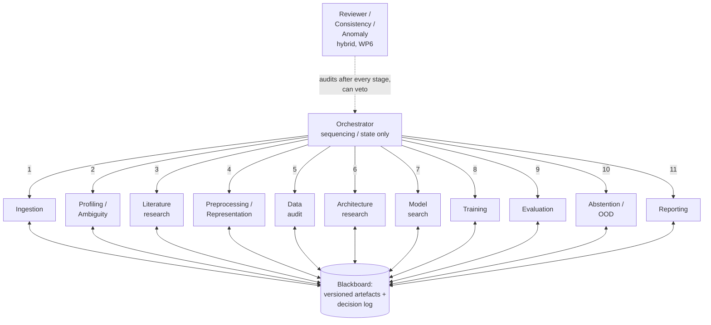

# Agentic MedMNIST

A hybrid multi-agent framework for researching, selecting, training and evaluating neural networks on [MedMNIST](https://medmnist.com/). The current implementation is in [`v3/`](v3/), with PathMNIST as its experiment target.

The contribution is the coordinated experimental process: specialized agents make modeling decisions, deterministic components execute experiments, and an independent reviewer checks each stage. Decisions and results are preserved as typed, versioned artefacts with a chronological event log.

The repository also includes a local React dashboard for the completed PathMNIST run, with task summaries, statistical tables and an interactive graph of recorded agent invocations.

## Architecture

Agents and Ollama requests execute sequentially. The orchestrator dispatches tasks and invokes the reviewer; task agents exchange information through the Blackboard rather than calling one another. Experiment tasks can invoke a local subprocess worker.



The numbered arrows show sequential dispatch in the autonomous run, not parallel execution or direct calls between tasks. Each task exchanges typed, versioned artefacts with the Blackboard. Depending on execution settings, the search stage can instead use a bounded search, a single experiment-design decision or a previously frozen configuration.

| Agent or role | Contribution |
| --- | --- |
| Orchestrator | Sequence tasks, apply review gates and coordinate revisions. |
| Ingestion | Load PathMNIST and retain its official partitions. |
| Data profiler | Examine class balance, image quality and potential label ambiguity. |
| Literature researcher | Gather source-backed ideas and propose extensions. |
| Representation designer | Choose normalization and training-only augmentations. |
| Data auditor | Check inputs, splits and train-only statistics before training. |
| Architecture researcher | Match candidate architectures to the task and input resolution. |
| Model search | Compare candidate configurations using validation metrics. |
| Model trainer | Train or retain the selected model and checkpoint. |
| Evaluator | Compute aggregate and per-class metrics on the held-out test set. |
| Uncertainty analyst | Calibrate abstention on validation and evaluate controlled corruption scenarios. |
| Report writer | Summarize decisions, results and their interpretation. |
| Independent reviewer | Check evidence consistency, request corrections and apply review policy. |
| Experiment worker | Execute model verification, training and prediction jobs locally. |

## Framework setup

Use a Python environment compatible with [`v3/requirements.txt`](v3/requirements.txt). The included autonomous run used Python 3.11. Install dependencies and run commands from `v3`:

```bash
cd v3
python -m pip install -r requirements.txt
```

The dependencies include PyTorch, Lightning, MedMNIST, Pydantic and scikit-learn. CUDA is the default execution device; specify `--device cpu` for CPU execution. The first dataset download requires network access. `--data-root` selects a dataset cache and `--no-download` requires the dataset to be present already.

### Offline demonstration

The default `legacy` mode supports bounded search and heuristic decisions when no LLM is configured. For a small CPU demonstration:

```bash
python run.py --execution-mode legacy --offline --quick --device cpu --search-trials 2 --search-rounds 1 --search-epochs 1 --max-epochs 3
```

`--quick` uses stratified subsets of 6,000 training, 1,200 validation and 1,800 test images. `--offline` disables LLM use; it does not automatically disable dataset downloads. This demonstration is different from the full-data autonomous run described below.

### Autonomous research and model search

Start an Ollama server and make the chosen model available before launching the experiment. The configured model must resolve during preflight.

```bash
python run.py --execution-mode agent_autonomous --ollama-base http://localhost:11434 --ollama-model qwen2.5:7b --seeds 42 --device cuda
```

`qwen2.5:7b` is the CLI's default model name; replace it with a model available on your server. The included run recorded `qwen3.8:latest`. Environment variables `AGENTIC_LLM_BASE` and `AGENTIC_LLM_MODEL` can supply the corresponding settings.

The LLM integration uses Ollama's native `/api/chat` endpoint with JSON schemas, through Python's standard library. Use the server root URL, without a `/v1` suffix; no LLM SDK is required.

In `agent_autonomous` mode:

- Agents choose search actions and training durations based on preceding results.
- Generated experiment code executes in local subprocess workers. This mode enables generated code and skips the separate baseline automatically.
- A live configured Ollama model is required for a new run; heuristic fallback is not used to replace autonomous decisions.
- External search budgets such as `--search-trials`, `--search-rounds`, `--search-epochs`, `--max-epochs` and `--max-generated-bundles` are rejected. `--offline` and `--no-search` are also incompatible.
- Configuration selection uses validation metrics, with an accuracy tolerance and macro-F1 tie-breaking. Test metrics are excluded from selection.

Built-in model families include tiny CNN, residual CNN, ResNet18, vision transformer, compact transformer, multiscale transformer and feature-pyramid transformer. Availability does not mean every family is evaluated in each run.

Run `python run.py --help` for the complete CLI. Baseline comparison and representation ablations are available through the applicable run settings; they were not performed in the included autonomous experiment.

## Evidence, research and reproducibility

The pipeline audits the dataset before training, uses training-only preprocessing statistics, and keeps the test set outside model selection. Each stage produces versioned artefacts; prompts, validated decisions and review records support inspection of the experimental process.

- **Literature:** `--research-online` searches arXiv and snapshots abstracts. `--require-research` rejects fallback to curated excerpts. A traceable quote or abstract does not independently establish every design inference or performance claim.
- **Extensions:** new proposals require hash-bound independent review through `--extension-approvals`. Existing built-in models and augmentation primitives remain distinct from proposed extensions.
- **Resume:** `--resume-run` continues a verified paused seed directory into a new child run. It is an operational continuation, not an arbitrary rerun of a completed experiment.
- **Replay:** `--replay-run` restores recorded settings and decisions without new LLM or retrieval requests. It requires the original source tree and verified transcript context; it can still execute training and predictions.
- **Repeated seeds:** `--seeds 42,43,44` requests repeated runs. By default, the first seed's validation-selected configuration is frozen for subsequent seeds; `--search-per-seed` requests independent searches instead.
- **Acceptance:** `--validation-evidence` and `--acceptance-evidence` attach validation and independent demonstration evidence. Successful execution and complete acceptance evidence are separate outcomes.

Seeds, source fingerprints and checksums support traceability. They do not, on their own, demonstrate that retraining reproduces identical predictions. Local subprocess execution does not imply enforced container isolation.

### Output layout

With the default output root, experiments are stored under `v3/runs/pathmnist_<timestamp>/`:

```text
pathmnist_<timestamp>/
  experiment_summary.json       # aggregate status and results across seeds
  best_task_config.yaml         # task-level validation-selected configuration
  generated/                    # retained generated experiment bundles, when used
  literature_cache/             # source snapshots, when used
  seed_42/
    artefacts/                  # versioned typed stage outputs and reviews
    blobs/                      # models, predictions, training logs and decisions
    decision_log.jsonl          # chronological execution events
    dossier.json                # artefact registry and consolidated run state
    best_config*.yaml           # seed-level selected configuration
    report_summary*.md          # report versions
    acceptance_report.json      # acceptance criteria and evidence status
```

Available files depend on the execution mode and completed stages. Baseline and comparison results are absent when those stages are skipped.

For an existing experiment directory, the stored-evidence auditor reads each `seed_*` directory and writes its findings to a JSON file outside the original run:

```bash
python audit_run.py runs/pathmnist_20261008T090954174041Z --output audits/pathmnist_20261008.json
```

`check_checkpoint_evidence.py` is a separate CPU inference checker for compatible Lightning checkpoints with both agentic and baseline evidence. Its `--output` argument names a directory outside the experiment. It is not the appropriate checker for the included generated-model run without a baseline, and checkpoint inference is distinct from retraining replay.

## Included PathMNIST experiment

The dashboard presents **`pathmnist_20261008T090954174041Z`, seed 42**. It used the complete official dataset, evaluated eight generated experiment configurations and selected the tuned ResNet18 checkpoint.

| Result | Value |
| --- | --- |
| Training / validation / test images | 89,996 / 10,004 / 7,180 |
| Candidate experiments | 8 completed |
| Recorded LLM decisions | 28, including one unsuccessful proposal attempt |
| Selected model | Tuned ResNet18, trial 7 |
| Validation checkpoint accuracy | 99.5902% |
| Validation checkpoint macro-F1 | 0.995778 |
| Held-out test accuracy | 91.7827% |
| Test accuracy 95% interval | 91.1249–92.3958% |
| Held-out test macro-F1 | 0.890046 |
| Test balanced accuracy | 89.3666% |
| Test macro ROC-AUC | 0.980611 |
| Test coverage at the 80% validation coverage target | 69.2758% |
| Accuracy among accepted test predictions | 97.5875% |
| Test images routed to human review | 2,206, or 30.7242% |
| Controlled-corruption test OOD AUROC | 0.943354 |

The selected ResNet18 used AdamW with learning rate `0.0002`, weight decay `0.01`, head dropout `0.3`, label smoothing `0.05`, class weighting and a cosine schedule. Training completed 29 epochs and retained the checkpoint from epoch 17. The saved-checkpoint score is distinct from the maximum accuracy observed on the training curve.

These results support the model choice among the tested configurations. The separate-center test accuracy was 7.81 percentage points below validation. Cancer-associated stroma was the weakest class, with 52.0% recall and F1 0.667. One seed was evaluated, without a separate baseline comparison or representation ablations. The OOD evaluation used Gaussian pixel corruption, so it does not establish robustness to staining or scanner shifts. The run completed with warnings, while acceptance readiness and technical completeness remained false.

## React dashboard

The local app in [`v3/run-explorer/`](v3/run-explorer/) presents this completed run in English. It does not require Python, Ollama or a training session to open the bundled results.

Requirements: Node.js 20.19+ or 22.12+ and npm. From the repository root:

```powershell
cd v3/run-explorer
npm.cmd install
npm.cmd run dev
```

On Linux/macOS, use `npm install` and `npm run dev`. On Windows, `npm.cmd` avoids PowerShell restrictions on `npm.ps1`. Open the local URL printed by Vite, normally `http://127.0.0.1:5173/`.

### Task dashboard

- OLED black background, colored agent boxes on the left and task descriptions on the right.
- Fourteen task/role boxes covering the eleven phases, orchestrator, reviewer and worker.
- Editorial summaries explaining objectives, choices and observed outcomes, with relevant interpretation limits.
- Statistical tables for data quality, experiments, configuration, evaluation, class performance, abstention and acceptance; a separate selected-model training curve.
- Manual **Previous / Next** controls and keyboard arrows. Selecting a task opens its first step; there is no automatic replay.
- Bounded screens designed for 1366×768 and larger windows, with smaller windows scaling the desktop layout. Reduced-motion preferences disable decorative transitions.

This is a dashboard for the included run, not a general run importer. Raw files, hashes, prompts and JSON are not displayed in the product interface.

### Agent call graph

Use **Agent call graph** to open `#/graph`. **Back to dashboard** restores the previous task and step. The dashboard can also be addressed at `#/dashboard`.

The graph contains **one rectangle per agent/role**, with **56 recorded invocations grouped into 15 directional connections**:

| Invocation type | Count |
| --- | --- |
| Task starts, including the reporting revision | 12 |
| Independent reviewer invocations | 12 |
| Worker verification, training and prediction executions | 32 |

A badge such as **`#02 · ×12`** identifies the first chronological call on that connection and its total number of passes. Click a badge to inspect a paginated list of the calls, with task context and original UTC timestamps. Repeated calls share a connection rather than adding duplicate agent boxes.

Use **Previous call / Next call** or keyboard arrows to follow the invocation sequence. The current source, destination and connection are highlighted. **Overview** returns to the complete graph, while **Fit graph** and zoom controls help inspect the diagram.

Hover or focus a rectangle for a short summary of that agent's decisions and contribution. Clicking pins the summary; Escape closes it. **Explore this task** opens the corresponding dashboard task at its first step.

Call numbering covers orchestrator dispatch, independent review and stage-owned worker execution. Internal LLM decisions, request repairs, heartbeats and returned results are not counted as additional agent invocations. The graph does not imply direct calls between consecutive task agents.

See the [dashboard README](v3/run-explorer/README.md) for detailed navigation and maintenance instructions.

## Checks

From `v3`, run the Python framework's unittest suite:

```bash
python -m unittest discover -s tests
```

From `v3/run-explorer`, check the dashboard data model, interface behavior and production build:

```powershell
npm.cmd test
npm.cmd run test:ui
npm.cmd run build
```

The dashboard checks cover decision coverage, source-backed statistics, graph counts and directions, repeated-call aggregation, task and call navigation, summaries and page transitions. Browser geometry and visual readability require a separate visual check; passing jsdom tests does not demonstrate those properties.

`npm.cmd run prepare-run` regenerates the dashboard's bundled internal evidence from the original PathMNIST seed directory without modifying the run. The built frontend must be served over HTTP rather than opened as a `file://` document.

## Repository map

| Path | Purpose |
| --- | --- |
| [`v3/run.py`](v3/run.py) | Experiment CLI and configuration. |
| [`v3/agents.py`](v3/agents.py), [`v3/orchestrator.py`](v3/orchestrator.py) | Task agents, reviewer and sequential coordination. |
| [`v3/contracts.py`](v3/contracts.py), [`v3/llm.py`](v3/llm.py) | Typed Blackboard interfaces and Ollama decision integration. |
| [`v3/autonomous.py`](v3/autonomous.py), [`v3/generated_agents.py`](v3/generated_agents.py) | Autonomous search and generated experiment development/execution. |
| [`v3/lightning_components.py`](v3/lightning_components.py), [`v3/worker_runtime.py`](v3/worker_runtime.py) | Model implementations and worker training/prediction primitives. |
| [`v3/research.py`](v3/research.py), [`v3/extensions.py`](v3/extensions.py) | Literature snapshots and reviewed extensions. |
| [`v3/resume.py`](v3/resume.py), [`v3/replay.py`](v3/replay.py) | Verified continuation and recorded-decision replay. |
| [`v3/governance.py`](v3/governance.py), [`v3/audit_run.py`](v3/audit_run.py) | Acceptance evidence and stored-run auditing. |
| [`v3/tests/`](v3/tests/) | Framework regression and fault-injection tests. |
| [`v3/runs/`](v3/runs/) | Experiment results and supporting evidence. |
| [`v3/run-explorer/`](v3/run-explorer/) | React dashboard and agent call graph. |
| [`docs/`](docs/), [`latex_docs/`](latex_docs/), [`Presentation/`](Presentation/) | Supporting project documents and presentation material. |

The work-package mapping remains: WP1 requirements and interfaces; WP2 data understanding and research; WP3 modeling and training; WP4 evaluation and comparisons; WP5 abstention, handoff and replay; WP6 independent review and anomaly handling. Actual completion is determined by each run's evidence and acceptance report.
