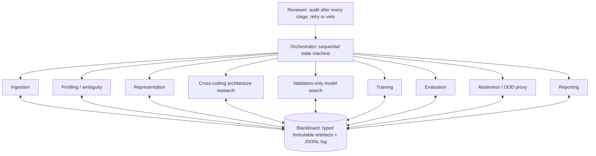

# HAT-MedMNIST: robust sequential agents and LightningCLI on PathMNIST

Per la descrizione completa in italiano di agenti, procedure, parametri,
contratti e API, consultare il [manuale del codice](MANUALE_CODICE_AGENTI.md).

This repository is a reproducible MVP of the HAT-MedMNIST proposal. It uses
small, role-specialised agents to search and train bounded neural architectures
on **PathMNIST**. PyTorch Lightning is the deterministic execution engine and
`LightningCLI` is the reproducible model-training interface. The contribution
remains orchestration, typed hand-offs, provenance and review gates, not a
clinical classifier.

PathMNIST is a nine-class, three-channel histology benchmark. The official
MedMNIST split is train 89,996 / validation 10,004 / test 7,180; the test set
comes from a different clinical centre. The pipeline preserves these splits and
never creates validation data by randomly splitting the training set.

## Architecture



Agents do not call one another. They communicate through Pydantic contracts in
`contracts.py`. A Blackboard write creates an immutable, numbered JSON envelope
with a SHA-256 checksum; every stage, decision, retry and gate is appended to
`decision_log.jsonl`.

## Ollama and the one-call-at-a-time rule

Only declared judgement points use model reasoning: ambiguity, representation,
cross-cutting architecture research, bounded search proposals and review comments. Training, metrics, ranking and
promotion rules remain deterministic. The
shared `OllamaReasoner` calls Ollama's native `/api/chat` endpoint with a JSON
Schema, temperature 0 and a global lock. Consequently, agents and retries are
always executed sequentially and at most one Ollama request is active in the
process. Invalid output is rejected by the schema and replaced with a validated
heuristic; use `--require-llm` to make such a failure fatal.

The research agent studies representation, parametrization and training
architecture together and supplies an auditable brief to every search round.
The search can choose among `tiny_cnn`, `residual_cnn`, a CIFAR-style
`resnet18`, `vision_transformer` (configurable patches) and `compact_transformer`
(convolutional tokenizer), and can vary width, depth, dropout, optimizer, scheduler, learning
rate, weight decay, class weighting, label smoothing, batch size and guarded
representations. It cannot emit Python code or select values outside the typed
contracts.

The agent selects the training horizon and stopping policy along with model,
representation and optimizer settings. The enlarged search space is:

| Parameter | Available range |
| --- | --- |
| Desired epochs | 1–1,000, capped by `--max-epochs` (default **100**, previously 15) |
| Early stopping patience | 0–500; 0 disables early stopping |
| Early stopping monitor / min delta | `val_accuracy`, `val_macro_f1`, `val_loss` / 0–1 |
| Hidden width | 8–1,024, multiples of 8; ResNet18 up to 256, residual CNN up to 512 |
| Depth | 1–48; tiny CNN up to 4 because each block halves 28×28 inputs; ResNet18 topology fixed |
| CNN channel cap | 8–4,096, multiples of 8; default 256 preserves old architectures |
| Batch size | Any integer from 4 to 4,096 |
| Learning rate / weight decay | 1e-7–1 / 0–1 |
| Dropout / label smoothing / gradient clip | 0–0.95 / 0–0.5 / 0–100 |
| Transformer patch size | 1, 2, 4, 7, 14, 28 |
| Attention heads / MLP ratio / CCT tokenizer depth | 1–32 / 1–16 / 1–5 |
| Search ceilings | 256 trials, 16 rounds; at most 16 adaptive proposals per call |

Agents can also tune SGD momentum/Nesterov, Adam betas/epsilon, cosine minimum
LR, one-cycle warmup fraction and plateau factor/patience. Heads must divide
the embedding width; Nesterov needs positive momentum. Inactive options are
canonicalized so they cannot manufacture duplicate trials. Larger settings may
exhaust GPU memory; failed trials are recorded rather than silently resized.
The guarded representation space also includes 180-degree rotation and mild,
deterministic brightness or contrast variants in addition to the original flips.
Up to eight distinct approved augmentation variants can be selected.

`--search-epochs` controls the initial exploration ceiling, not the candidate's
desired horizon. Exploration ceilings grow by round; the last round gives all
finalists the shared `--max-epochs` ceiling. Each candidate trains for
`min(proposed_epochs, round_ceiling)`, possibly ending earlier via its own stopping
policy. Ranking compares the same **allocated ceiling**, while proposed/effective
epochs, actual epochs and learning curves remain visible to the next decision.
Thus epochs and early stopping are genuine search hyperparameters. Final training
preserves the selected horizon and stopping settings; it no longer forces the
maximum epoch count or replaces patience with a heuristic. If every final-budget
trial fails, selection fails explicitly. Default epoch ceilings have increased:
full runs can take longer, especially with stopping disabled.

Use Python 3.10 or newer. Ollama is optional for offline validation, but add
`--require-llm` when an experiment must fail rather than fall back if the local
model is unavailable or returns invalid structured output.

```bash
python -m pip install -r requirements.txt
ollama pull qwen2.5:7b

# Inspect or run the native LightningCLI configuration
python lightning_cli.py fit --config configs/lightning_pathmnist.yaml --print_config
python lightning_cli.py fit --config configs/lightning_pathmnist.yaml

# Fast agentic search on a stratified 6000/1200/1800 demonstration subset
python run.py --quick \
  --search-trials 4 --search-rounds 2 --search-epochs 2 --max-epochs 8 \
  --ollama-base http://localhost:11434 \
  --ollama-model qwen2.5:7b --require-llm

# Offline search with the validated deterministic candidate pool
python run.py --quick --offline --search-trials 4 --max-epochs 8

# Full official splits, frozen winner across seeds, baseline and ablations
python run.py --seeds 42,47,72 --ablation-suite \
  --search-trials 6 --search-rounds 2 --search-epochs 3 --max-epochs 15 \
  --ollama-base http://localhost:11434 \
  --ollama-model qwen2.5:7b
```

By default, search runs on the first seed and the validation-selected
configuration is frozen and replayed for later seeds. This makes repeated-run
variance interpretable. `--search-per-seed` is available for exploratory work,
but should not be used for the final seed-stability claim. `--no-search`
restores the earlier one-decision design.

## Leakage-safe selection rule

The search loop never receives test metrics. Each round follows this sequence:

1. Ollama proposes up to 16 schema-valid candidates when adaptive slots exist.
2. Lightning trains candidates sequentially with progressive round budgets
   (`search_epochs`, `2 * search_epochs`, ...); the last round uses `max_epochs`
   as its shared ceiling. Candidates can choose shorter horizons and their own
   early stopping. Promotions rank only the latest successful budget, and final
   ranking compares only completed trials with the final allocated ceiling.
3. Deterministic code evaluates validation accuracy, balanced accuracy and
   macro-F1.
4. The next Ollama call receives training curves, actual epochs and prior
   validation results, along with proposed/effective horizons and budget caps.
5. The winner is selected by validation accuracy; candidates within the
   declared tolerance (default 0.5 percentage points) are ordered by macro-F1.
6. The winner is retrained, frozen, and only then evaluated on test.

Exploration prioritizes adaptive proposals and permits at most one forced
architecture-coverage slot per round. The final round promotes finalists;
five-family coverage is reported and is not guaranteed by a small budget.
Selection-time profiling contains only train and validation statistics;
representation and model-design prompts never receive test labels,
distributions, predictions or performance.

The task-level winner is written to `best_task_config.yaml`, directly reusable
with `lightning_cli.py`. Every per-seed winner is also stored as
`best_config.yaml` with its SHA-256 checksum.

The dataset is downloaded by MedMNIST into its normal cache. Use
`--data-root PATH` to choose another cache and `--no-download` to require an
already-present archive. CUDA is the CLI default; use `--device cpu` when a
compatible GPU is unavailable.

## What is measured

- selection-time profiling covers every loaded train/validation sample and
  records class counts, channel statistics, blank-image and duplicate checks,
  the official archive MD5 and selected-index fingerprints; test remains
  sealed until final evaluation;
- preprocessing computes normalization statistics on **train only**, applies
  augmentation only to train, and records the official split manifest;
- training is seeded, runs through Lightning with a deterministic DataLoader,
  early stopping and gradient clipping, and writes a checksummed best
  checkpoint; every epoch is also emitted as a stable console line and written
  to both a Lightning CSV log and a compact `*.training.jsonl` history next to
  the checkpoint. Their paths are persisted in the training/search/baseline
  artefacts;
- model search is budgeted, deduplicated by configuration hash and driven only
  by validation evidence; failed trials remain auditable artefacts. Exploration
  rounds prioritize adaptive proposals, with at most one forced coverage slot.
  Promotions rank only the latest successful epoch budget; the final round
  compares its finalists at the larger budget. An 8-trial / 3-round search
  normally allocates 3/3/2 trials, with four adaptive slots, one coverage trial,
  one intermediate promotion and two finalists.
  Small budgets cannot guarantee coverage of all five families. Rounds with
  no adaptive capacity do not call the LLM; duplicate proposals fall back to
  the portfolio. Early-stop requests cannot skip the final comparison;
- evaluation reports accuracy, balanced accuracy, macro/per-class precision,
  recall, F1, one-vs-rest ROC-AUC (when defined), Wilson 95% intervals for
  accuracy and per-class recall, and a confusion matrix;
- abstention calibrates on validation and compares max-softmax with predictive
  entropy on three Gaussian-noise severities; score selection uses validation,
  while test remains evaluation-only. It also records validation-calibrated
  risk/coverage points from 50% through 90% coverage. Eligibility requires every
  validation corruption scenario to meet `--ood-min-auroc` (default 0.65) and
  `--ood-max-false-accept` (default 0.20) at the clean-validation threshold.
  These are explicit engineering defaults, not empirically validated clinical
  cutoffs. Freeze them before evaluating the test set. If no detector qualifies,
  `detector_status=no_eligible_detector` disables automatic acceptance and sends
  all cases to review. The retained method/threshold and scenario false-accept
  rates describe the rejected detector for diagnosis; risk/coverage masks are
  disabled too. Zero coverage uses the existing accuracy=0/risk=1 convention.
  `ood_pass` additionally requires the same limits on held-out corruptions;
  a test failure is reported without changing validation-selected routing.
  `--ood-corruption-seed` defaults to 1729, independently of training seeds;
- the conventional baseline uses the exact same selected split and seed; the
  optional ablation suite runs three representation scenarios;
- `--seeds 42,43,44` produces a mean and population standard deviation for
  repeated-run variance only when every requested seed completes; otherwise
  the summary is explicitly marked partial and invalid as an aggregate.

## Outputs

Each invocation creates a new directory under `runs/pathmnist_<timestamp>/`:

```text
seed_42/
  artefacts/                  # immutable 0001_name_v001.json files
  blobs/                      # Lightning checkpoints, per-epoch logs, predictions and OOD evidence
    lightning_logs/           # native Lightning CSVLogger output (`metrics.csv`)
  best_config.yaml            # selected LightningCLI configuration
  decision_log.jsonl          # stage, LLM, retry and gate provenance
  dossier.json                # final latest-artifact view
experiment_summary.json      # seed comparison and variance
best_task_config.yaml         # validation-selected task configuration
```

Per-sample validation/test probabilities, logits, targets and predictions are
stored in a checksummed NPZ. Run manifests include the source-tree SHA-256,
package versions and, when exposed by Ollama, the immutable model digest.
Baseline and ablation checkpoints are checksummed as well.
Integrity validation recursively checks nested evidence and literature snapshots.
New frozen-seed runs include `blobs/frozen_source_config.yaml`; historical
`frozen_best` references resolve to the original sibling seed. Historical files
are read without migration. Source hashes use `canonical-text-v2` (POSIX relative
paths, normalized line endings and length-delimited content); manifests without
an algorithm retain legacy semantics. File evidence hashes still verify exact
bytes. A historical replay still requires its original code revision.

Exported `best_config.yaml` shares checkpoint selection (`val_accuracy`, max,
top-1) and optional early stopping with the agent trainer. Logging/output paths
remain execution-specific. CLI evaluation should load the best checkpoint
explicitly rather than assume the final epoch is the selected model.

## Tests

The dependency-light tests do not download data. They cover contract bounds,
Ollama JSON-schema validation and fallback, global request serialization,
official split preservation, remediation-aware retry/veto behaviour,
validation-only search and ranking, OOD scoring, multiclass metrics and ten
fault-injection cases, plus real Lightning CPU training and offline replay on
small synthetic datasets. They do not establish full-dataset accuracy or CUDA
reproducibility.

```bash
python -m unittest discover -s tests -v
```

## Files

| File | Responsibility |
| --- | --- |
| `contracts.py` | Pydantic contracts, immutable Blackboard and decision log |
| `llm.py` | provider-neutral seam with sequential Ollama implementation |
| `ml.py` | PathMNIST loading, deterministic data, training and metrics primitives |
| `lightning_components.py` | model registry, LightningModule and DataModules |
| `lightning_cli.py` | native LightningCLI (`fit`, `validate`, `test`, `predict`) |
| `search.py` | candidate hashing, fallback portfolio, ranking and CLI config export |
| `agents.py` | ingestion, profiling, representation, search, training, evaluation, abstention, reporting and reviewer |
| `orchestrator.py` | sequential stage gates, bounded retries and veto handling |
| `baseline.py` | conventional baseline and representation ablations |
| `run.py` | CLI, repeated seeds and experiment summary |
| `tests/` | contract, integration-with-fakes and fault-injection tests |

This is a non-clinical research/engineering demonstrator; it makes no
diagnostic or patient-facing claim.
