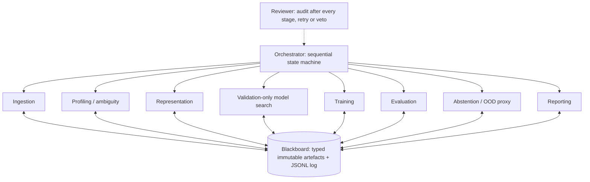

# HAT-MedMNIST: robust sequential agents and LightningCLI on PathMNIST

This repository is a reproducible MVP of the HAT-MedMNIST proposal. It uses
small, role-specialised agents to search and train bounded neural architectures
on **PathMNIST**. PyTorch Lightning is the deterministic execution engine and
`LightningCLI` is the reproducible model-training interface. The contribution
remains orchestration, typed hand-offs, provenance and review gates, not a
clinical classifier.

PathMNIST is a nine-class, three-channel histology benchmark. The official
MedMNIST split is train 89,996 / validation 10,004 / test 7,180; the test set
comes from a different clinical centre. The pipeline preserves these splits and
never creates validation data by randomly splitting the training set.

## Architecture



Agents do not call one another. They communicate through Pydantic contracts in
`contracts.py`. A Blackboard write creates an immutable, numbered JSON envelope
with a SHA-256 checksum; every stage, decision, retry and gate is appended to
`decision_log.jsonl`.

## Ollama and the one-call-at-a-time rule

Only declared judgement points use model reasoning: ambiguity, representation,
bounded search proposals and review comments. Training, metrics, ranking and
promotion rules remain deterministic. The
shared `OllamaReasoner` calls Ollama's native `/api/chat` endpoint with a JSON
Schema, temperature 0 and a global lock. Consequently, agents and retries are
always executed sequentially and at most one Ollama request is active in the
process. Invalid output is rejected by the schema and replaced with a validated
heuristic; use `--require-llm` to make such a failure fatal.

The search agent can choose among `tiny_cnn`, `residual_cnn` and a CIFAR-style
`resnet18`, and can vary width, depth, dropout, optimizer, scheduler, learning
rate, weight decay, class weighting, label smoothing, batch size and guarded
representations. It cannot emit Python code or select values outside the typed
contracts.

Use Python 3.10 or newer. Ollama is optional for offline validation, but add
`--require-llm` when an experiment must fail rather than fall back if the local
model is unavailable or returns invalid structured output.

```bash
python -m pip install -r requirements.txt
ollama pull qwen2.5:7b

# Inspect or run the native LightningCLI configuration
python lightning_cli.py fit --config configs/lightning_pathmnist.yaml --print_config
python lightning_cli.py fit --config configs/lightning_pathmnist.yaml

# Fast agentic search on a stratified 6000/1200/1800 demonstration subset
python run.py --quick \
  --search-trials 4 --search-rounds 2 --search-epochs 2 --max-epochs 8 \
  --ollama-base http://localhost:11434 \
  --ollama-model qwen2.5:7b --require-llm

# Offline search with the validated deterministic candidate pool
python run.py --quick --offline --search-trials 4 --max-epochs 8

# Full official splits, frozen winner across seeds, baseline and ablations
python run.py --seeds 42,47,72 --ablation-suite \
  --search-trials 6 --search-rounds 2 --search-epochs 3 --max-epochs 15 \
  --ollama-base http://localhost:11434 \
  --ollama-model qwen2.5:7b
```

By default, search runs on the first seed and the validation-selected
configuration is frozen and replayed for later seeds. This makes repeated-run
variance interpretable. `--search-per-seed` is available for exploratory work,
but should not be used for the final seed-stability claim. `--no-search`
restores the earlier one-decision design.

## Leakage-safe selection rule

The search loop never receives test metrics. Each round follows this sequence:

1. Ollama proposes one to four schema-valid candidates.
2. Lightning trains every candidate sequentially with the same declared search
   budget, so results from different rounds remain comparable.
3. Deterministic code evaluates validation accuracy, balanced accuracy and
   macro-F1.
4. The next Ollama call receives only prior validation results.
5. The winner is selected by validation accuracy; candidates within the
   declared tolerance (default 0.5 percentage points) are ordered by macro-F1.
6. The winner is retrained, frozen, and only then evaluated on test.

Test-split counts are retained only in the independent data-audit artefact;
representation and model-design prompts receive train evidence (plus prior
validation scores) and never test labels, predictions or performance.

The task-level winner is written to `best_task_config.yaml`, directly reusable
with `lightning_cli.py`. Every per-seed winner is also stored as
`best_config.yaml` with its SHA-256 checksum.

The dataset is downloaded by MedMNIST into its normal cache. Use
`--data-root PATH` to choose another cache and `--no-download` to require an
already-present archive. CPU is the default device; `--device cuda` is
available when deterministic CUDA operations are supported.

## What is measured

- profiling covers every loaded sample and records class counts, channel
  statistics, blank-image and duplicate checks, the official archive MD5 and
  selected-index fingerprints;
- preprocessing computes normalization statistics on **train only**, applies
  augmentation only to train, and records the official split manifest;
- training is seeded, runs through Lightning with a deterministic DataLoader,
  early stopping and gradient clipping, and writes a checksummed best
  checkpoint; every epoch is also emitted as a stable console line and written
  to both a Lightning CSV log and a compact `*.training.jsonl` history next to
  the checkpoint. Their paths are persisted in the training/search/baseline
  artefacts;
- model search is budgeted, deduplicated by configuration hash and driven only
  by validation evidence; failed trials remain auditable artefacts;
- evaluation reports accuracy, balanced accuracy, macro/per-class precision,
  recall, F1, one-vs-rest ROC-AUC (when defined) and a confusion matrix;
- abstention calibrates on validation and compares max-softmax with predictive
  entropy on three Gaussian-noise severities; score selection uses validation,
  while test remains evaluation-only. OOD below chance is a deterministic
  warning and never a clinical OOD claim;
- the conventional baseline uses the exact same selected split and seed; the
  optional ablation suite runs three representation scenarios;
- `--seeds 42,43,44` produces a mean and population standard deviation for
  repeated-run variance.

## Outputs

Each invocation creates a new directory under `runs/pathmnist_<timestamp>/`:

```text
seed_42/
  artefacts/                  # immutable 0001_name_v001.json files
  blobs/                      # Lightning checkpoints, per-epoch logs, predictions and OOD evidence
    lightning_logs/           # native Lightning CSVLogger output (`metrics.csv`)
  best_config.yaml            # selected LightningCLI configuration
  decision_log.jsonl          # stage, LLM, retry and gate provenance
  dossier.json                # final latest-artifact view
experiment_summary.json      # seed comparison and variance
best_task_config.yaml         # validation-selected task configuration
```

Per-sample validation/test probabilities, logits, targets and predictions are
stored in a checksummed NPZ. Run manifests include the source-tree SHA-256,
package versions and, when exposed by Ollama, the immutable model digest.
Baseline and ablation checkpoints are checksummed as well.

## Tests

The dependency-light tests do not download data. They cover contract bounds,
Ollama JSON-schema validation and fallback, global request serialization,
official split preservation, remediation-aware retry/veto behaviour,
validation-only search and ranking, OOD scoring, multiclass metrics and ten
fault-injection cases. A real Lightning CPU smoke test is recommended after
installing requirements.

```bash
python -m unittest discover -s tests -v
```

## Files

| File | Responsibility |
| --- | --- |
| `contracts.py` | Pydantic contracts, immutable Blackboard and decision log |
| `llm.py` | provider-neutral seam with sequential Ollama implementation |
| `ml.py` | PathMNIST loading, deterministic data, training and metrics primitives |
| `lightning_components.py` | model registry, LightningModule and DataModules |
| `lightning_cli.py` | native LightningCLI (`fit`, `validate`, `test`, `predict`) |
| `search.py` | candidate hashing, fallback portfolio, ranking and CLI config export |
| `agents.py` | ingestion, profiling, representation, search, training, evaluation, abstention, reporting and reviewer |
| `orchestrator.py` | sequential stage gates, bounded retries and veto handling |
| `baseline.py` | conventional baseline and representation ablations |
| `run.py` | CLI, repeated seeds and experiment summary |
| `tests/` | contract, integration-with-fakes and fault-injection tests |

This is a non-clinical research/engineering demonstrator; it makes no
diagnostic or patient-facing claim.
